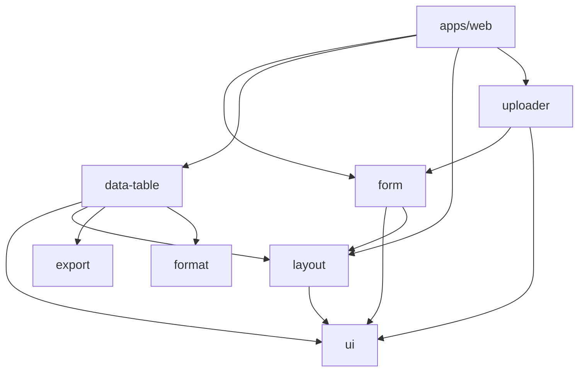

## Directory map

```
apps/web                 Playground, Fumadocs (/docs), examples
feature/form             FormKit, FieldKit, fields, combobox
feature/data-table       DataTable, toolbar, filters, bulk, selection
feature/layout           Breadcrumbs, navigation, form layout, dialogs
feature/uploader         Spreadsheet import dialog
feature/export           CSV / XLSX export helpers
feature/preferences      Theme & locale preference cookies
packages/ui              shadcn-style primitives + globals.css
packages/format          Formatting, masks, effective preferences
packages/config          Shared tsconfig
```

## Dependency flow



Kits never import from `apps/web`; demos import from kits only.

## Export surfaces

Package `exports` in each `package.json` define public entry points. Prefer subpaths when documented (`form/field-kit`, `data-table/filter`, `layout/navigation`) to keep bundles focused.

## Documentation source

MDX files live in `apps/web/content/docs`. Navigation order is controlled by `meta.json` in each folder (same pattern as [shadcn/ui v4](https://github.com/shadcn-ui/ui/tree/main/apps/v4/content/docs)). Fumadocs MDX compiles content through `src/lib/source.ts` and serves routes at `/docs/*`.
