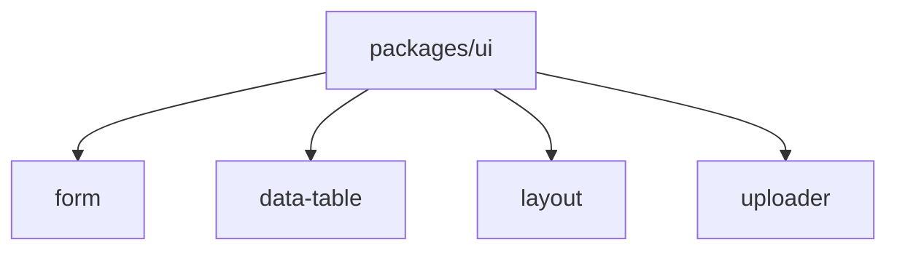

**`ui`** (`packages/ui`) is the shadcn-style design system for Feature Kit: primitives, tokens, and global styles that **`form`**, **`data-table`**, **`layout`**, and **`uploader`** compose.

## When to use it

- Adding a **new primitive** (button variant, dialog, field shell) shared across kits
- Theming the host app via **`ui/globals.css`** CSS variables
- Importing low-level controls when a kit does not expose a higher-level API

Prefer kit components (`FormKit.Field`, table toolbar pieces) before pulling raw UI into product screens—kits encode spacing, i18n, and accessibility patterns.

## Installation

Apps in this monorepo reference UI through TypeScript paths (see `apps/web/tsconfig.json`):

```tsx
import { Button } from "@/packages/ui/components/button"
import { cn } from "@/packages/ui/lib/utils"
```

Load global styles once in the app root:

```css
/* apps/web/src/app/globals.css */
@import "ui/globals.css";
```

Feature kits depend on `packages/ui` as a workspace package; you do not publish UI separately when working inside the monorepo.

## Structure

| Area | Location |
| --- | --- |
| Components | `packages/ui/src/components/*` |
| Utilities | `packages/ui/src/lib/utils.ts` (`cn`, etc.) |
| Theme | `packages/ui/src/globals.css` |
| Icons | Lucide via kit components |

Components follow the same patterns as shadcn/ui: Radix primitives, `class-variance-authority` variants, and Tailwind v4 tokens.

## Usage patterns

### Buttons & inputs

Kits re-use `Button`, `Input`, `Select`, `Dialog`, `Table`, and field shells from UI. When extending a kit, match existing variant names (`outline`, `ghost`, `destructive`) so tables and forms stay aligned.

### Theming

CSS variables in `globals.css` define `--background`, `--foreground`, `--primary`, and sidebar/chart tokens. `next-themes` toggles light/dark at the app level (`apps/web/src/app/providers.tsx`).

### Adding a component

1. Scaffold the primitive under `packages/ui/src/components/`.
2. Export from the package if other features need it.
3. Reference it from a feature kit instead of from app code when the control is reusable.

## Relationship to kits



## Gotchas

<DocsCallout title="Path aliases">
  The docs site uses `@/packages/ui/...`. Your app may use a different alias—keep imports consistent within each app.
</DocsCallout>

<DocsCallout title="Do not fork styles per kit">
  One `globals.css` import per app. Kits assume shared tokens; duplicating theme files causes drift between tables and forms.
</DocsCallout>

For component-level docs, browse `packages/ui/src/components` and the live previews under [Form](/docs/form) and [Data table](/docs/data-table).
